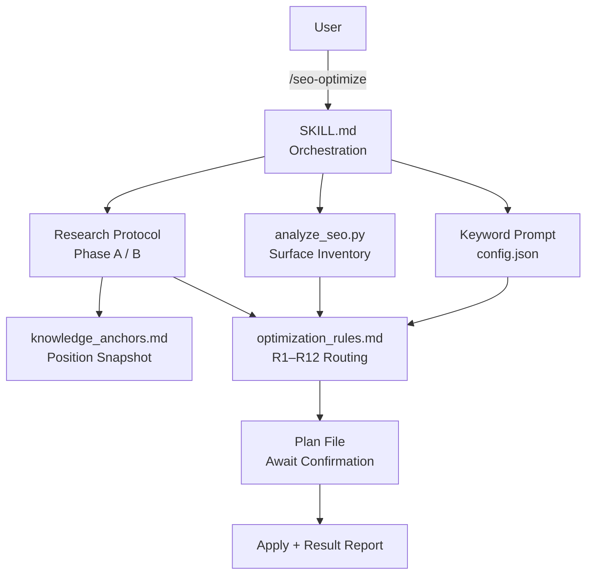

> [!NOTE]
> This README was generated by [SKILL](https://github.com/agenvoy/skill-readme-generate), get the ZH version from [here](./doc/README.zh.md). 
> This skill's implementation was fully agent-generated; the developer only tuned its input/output.

***

<strong>SEO AND AEO GROUNDED IN THIS SEASON'S RESEARCH!</strong>

***

> An agent skill with mandatory fresh research, surface-aware optimization rules, and a plan-before-apply workflow

## Table of Contents

- [Features](#features)
- [Architecture](#architecture)
- [License](#license)

## Features

> `/seo-optimize [PROJECT_PATH] [--plan] [--reset]` · [Documentation](./doc/doc.md)

- **Mandatory Research on Every Run** — Eleven parallel queries plus live WebFetch of Google, OpenAI, and Anthropic primary docs run each time, and the verified-position snapshot is rewritten in place when it disagrees, so tactics that reversed within six months never get applied from memory.
- **Primary Sources Override Industry Myths** — Sources are ranked in four tiers where official docs overrule blogs and AEO SaaS guides, overturned claims land in a "myths" column instead of the action list, and existing dead weight such as an llms.txt on a non-agent site is flagged as removable.
- **Surface-Aware Rule Routing** — The analyzer inventories code type and deployable web surfaces separately, so a library or CLI without a site only gets registry, GitHub, and entity-consistency work rather than fabricated page fixes.
- **Training vs. Retrieval Crawler Split** — robots.txt rules are classified by bot purpose, a wildcard site-wide block or a blocked retrieval bot is marked Critical, and opting out of training never costs citation eligibility.
- **Plan-Then-Apply Confirmation Gate** — A plan file with rule IDs and diff previews is produced and confirmed before any file changes, remote `gh repo edit` commands are listed but never run, and no git writes occur.

## Architecture

> [Full Architecture](./doc/architecture.md)

## License

This project is licensed under the [MIT LICENSE](LICENSE).
