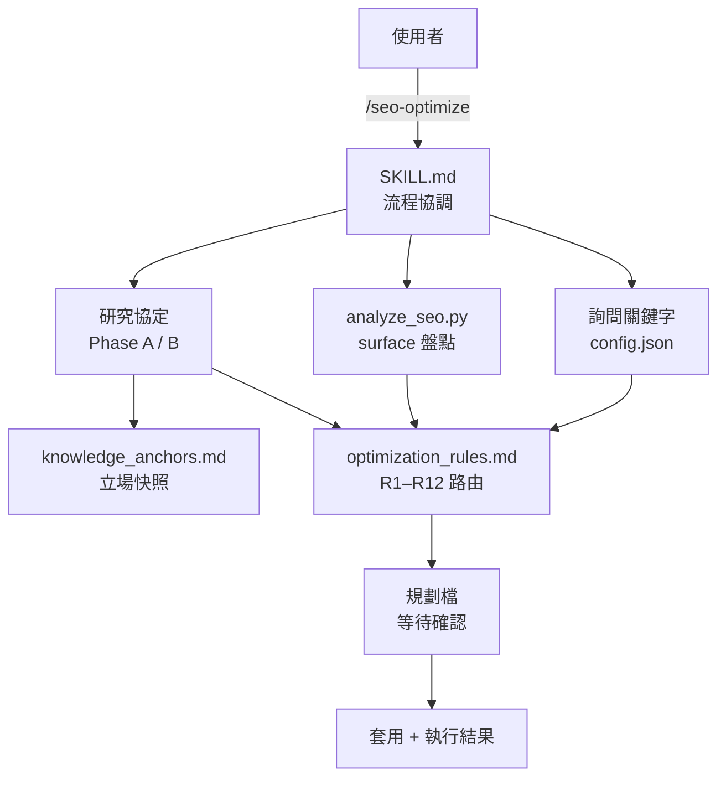

> [!NOTE]
> 此 README 由 [SKILL](https://github.com/agenvoy/skill-readme-generate) 生成，英文版請參閱 [這裡](../README.md)。 
> 此 skill 的實作內容全由 agent 生成，開發者僅針對 input / output 進行調整。

***

<strong>SEO AND AEO GROUNDED IN THIS SEASON'S RESEARCH!</strong>

***

> Agent Skill，具備每次強制重跑的近半年研究、依 surface 分流的規則與先規劃後套用的優化流程

## 目錄

- [功能特點](#功能特點)
- [架構](#架構)
- [授權](#授權)

## 功能特點

> `/seo-optimize [PROJECT_PATH] [--plan] [--reset]` · [完整文件](./doc.zh.md)

- **每次執行強制重跑研究** — 並行十一組查詢並以 WebFetch 實抓 Google、OpenAI、Anthropic 一手文件，與已驗證立場快照不符時就地更新快照，避免半年內已反轉的做法被憑記憶套用。
- **一手來源裁決業界迷思** — 來源分四級，官方文件直接推翻部落格與 AEO SaaS 指南，被推翻的主張進「業界迷思」欄而非待執行項，專案中既有的無效設定（如非 agent 文件站的 llms.txt）列為可移除項。
- **依 surface 分流的優化規則** — 分析器把程式碼類型與可部署的 web surface 分開盤點，無網站的函式庫／CLI 只優化套件登錄頁、GitHub 與實體一致性，不虛構頁面。
- **訓練型與檢索型 crawler 分流** — robots.txt 依 bot 用途歸類，萬用字元全站封鎖或擋掉檢索型 bot 直接列 Critical，退出訓練與保留引用資格可同時成立。
- **先規劃後套用的確認閘門** — 修改前先產出帶規則編號與 diff 預覽的規劃檔並等待確認，遠端 `gh repo edit` 只列指令、不執行任何 git 寫入。

## 架構

> [完整架構](./architecture.zh.md)

## 授權

本專案採用 [MIT LICENSE](../LICENSE)。
