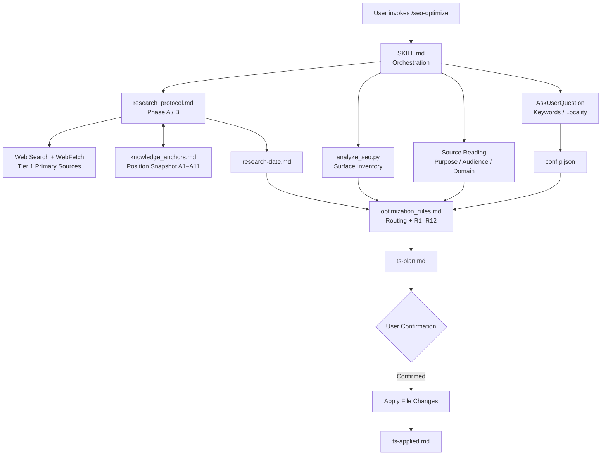
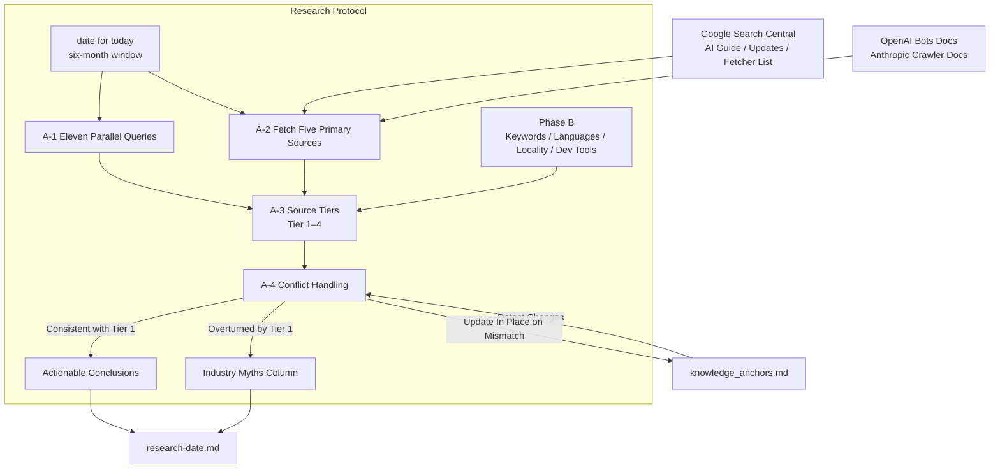
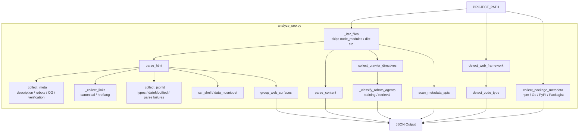
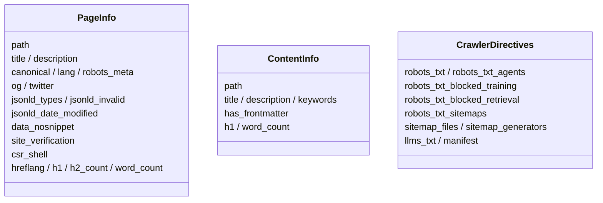
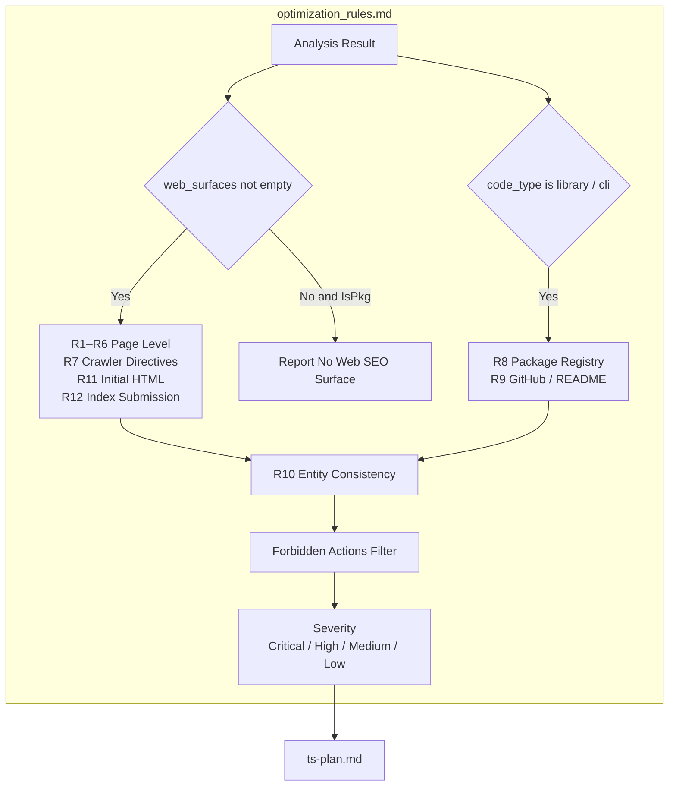
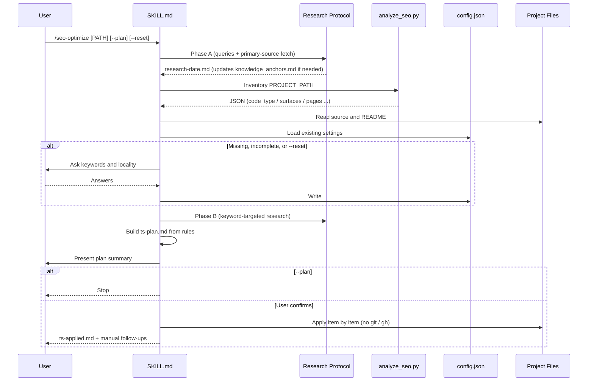
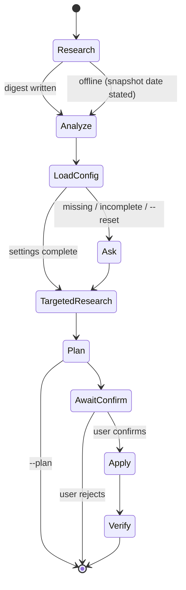

# seo-optimize - Architecture

> Back to [README](../README.md)

## Overview

## Module: Research Protocol

Fetches the last six months of SEO / AEO / GEO guidance on every run, resolves conflicts by source tier, and writes changes back to the position snapshot.

## Module: Analyzer (analyze_seo.py)

Performs a mechanical inventory only, reporting code type and deployable web surfaces separately and reporting absent surfaces as absent.

## Module: Rule Routing

Selects the active rule groups from `code_type` and `web_surfaces`, then filters suggestions through the forbidden-actions table.

## Data Flow

## State Machine

