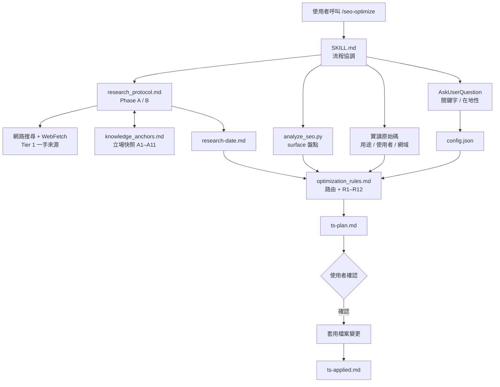
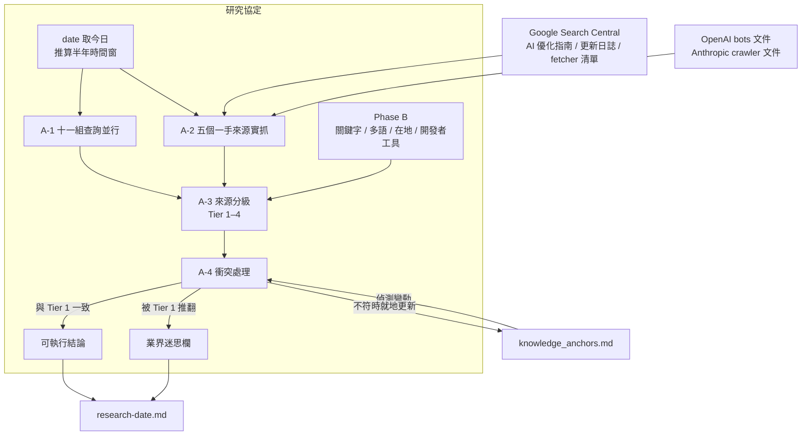
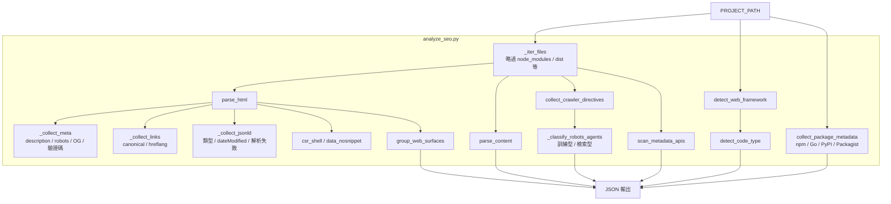
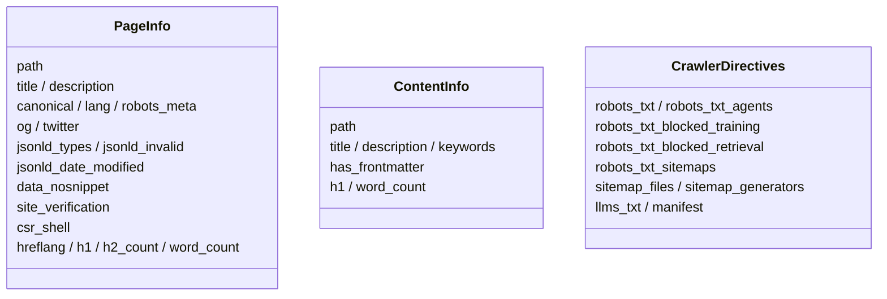
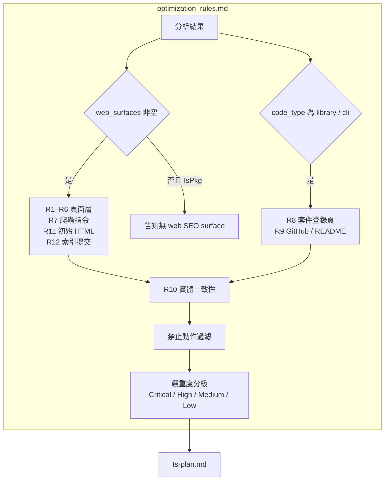
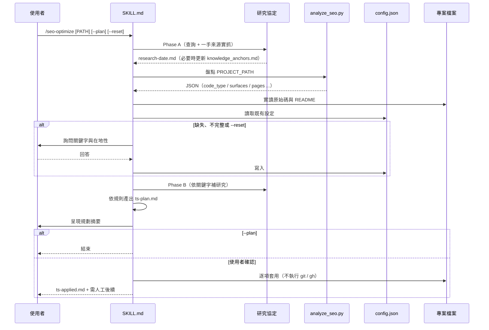
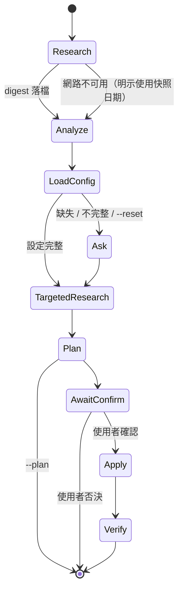

# seo-optimize - 架構

> 返回 [README](./README.zh.md)

## 概覽

## Module: 研究協定

每次執行都重新取得近半年的 SEO / AEO / GEO 現況，以來源分級裁決衝突，並回寫立場快照。

## Module: 分析器（analyze_seo.py）

只做機械盤點，把程式碼類型與可部署的 web surface 分開回報，不存在的 surface 回報為不存在。

## Module: 規則路由

依 `code_type` 與 `web_surfaces` 決定生效的規則組，並以禁止動作表過濾建議。

## 資料流

## 狀態機

